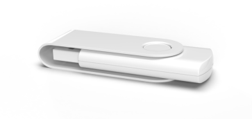

# Preparing the installation USB stick



## Downloading the image

The USB image can be downloaded from (OpenBSD website)[https://www.openbsd.org/]. 
You will find several options in the **Downloads** section. 
For USB you would like to download the `installXX.fs` file (not the ISO) and because Thinkpad T480 supports 64-bit architecture we select **amd64** version.

```sh
wget https://cdn.openbsd.org/pub/OpenBSD/6.7/amd64/install67.fs
```

## Writing the image into the USB

The easiest way to transfer the image into the USB stick is by using `dd` utility, which you will probably find on any unix-like machines.

```sh
dd if=/path/to/install67.fs of=/dev/sdX bs=1M status=progress
```

Provide the path to the downloaded `.fs` file for the `if` argument and the path to your USB for the `of` argument (you can find that path using `lsblk` utility).
`bs` parameter tells `dd` to use a bigger block size (so it will be faster) and with `status=progress` you will see the live progress istead of no info at all.


## Done.

You can now boot from the USB.


### WARNING

`dd` can be destructive if used incorrectly, that's why it's often called "Disk Destroyer". 
Make sure to double check your paths.
