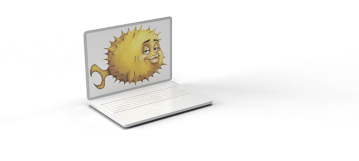

# OpenBSD for minimalists 

Installation, configuration & management on Thinkpad T480 (should work for other setup too).

This "book" covers the installation & configuration of OpenBSD.

[OpenBSD](https://www.openbsd.org/) is a secure, UNIX-like operating system with a clean codebase which makes it perfect for minimalists & perfectionists.

## I - Installation

- [1.1 - Preparing the installation USB stick](/installation/00-usb-stick.md)
- [1.2 - BIOS setup](/installation/01-bios-setup.md)
- [1.3 - Installation](/installation/02-installation.md)

## II - Configuration [WIP]
- [2.1 - Post-install configuration](/configuration/03-post-install.md)
- [2.2 - Wi-fi](/configuration/04-wifi.md)
- [2.3 - Sound](/configuration/05-sound.md)

## III - Window manager [WIP]
## IV- Usability [WIP]
## V - Daily tasks [WIP]
## VI - Troubleshooting [WIP]
 
---

### DISCLAIMER

Even though I am fairly experienced with programming and computers overall, I am not pretending to be any kind of expert.
I've decided to write down about my journey of getting to know OpenBSD better and use it as a reference for a future refreshment.

Feel free to contribute if you find a typo, misleading information or just have something important to add.
You can be mean to me, but please consider my life philosophy:

### Why OpenBSD?

- Great(est?) security thanks do code audit
- Clean codebase for minimalist lovers
- Simple installation
- Fine documentation
- Works out of the box - *It Just Works (TM)*

### Donations

If you appreciate my books and projects - please consider sponsorship via Github. Thank you for any donations.

### FAQ

- **Do you even know English?**

  I know that my language is bad sometimes, but I hope the key points are easy to understand. 
  If you're superior to me, please consider PR to fix any communication issues.
  
- **Do you know anything about computers?**
  
  I've spent most of my life learning new programming languages (way too many), reinstalling Linux distros and starting new projects that I've abandoned a week later.
  Still, due to my not so great memory, I'm not claiming to be an expert, just sharing what I know to be right at the moment.
  
- **Why OpenBSD? Is it really for minimalists?**

  If you're anything like me, you won't use a computer without knowing what runs on it (I'm talking about you, Windows & Mac), you won't use a ready made game engine but write it yourself and you won't program with OOP language because it's bloated. Just some old school C & BSD. This is a digital minimalism to me. I'm also a minimalist in real life (except for books, which I own hundreds of).
